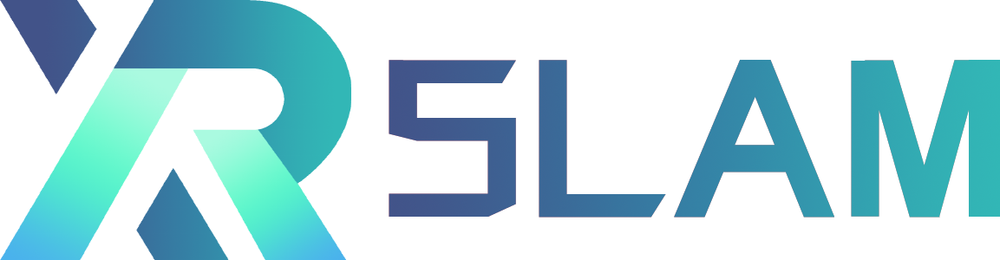

<br/>

<div align="center">
    
</div>
<br/>

<div align="left">
<div align="left">


[](https://xrslam.readthedocs.io/en/latest/)[](https://github.com/openxrlab/xrslam/actions)[](https://github.com/openxrlab/xrslam/blob/main/LICENSE)

</div>

## Introduction

OpenXRLab Visual-inertial SLAM Toolbox and Benchmark. It is a part of the OpenXRLab project.

https://user-images.githubusercontent.com/44204704/187863580-e3a1869e-0ff2-4319-8e86-9c669f2b15ef.mp4

https://user-images.githubusercontent.com/44204704/187863786-efbc3804-a4d8-4727-a7e2-ea45744330e4.mp4

### **Major Features**

* Robust and Lightweight optimization-based Visual Inertial Odometry
* Both desktop and mobile platforms are supported
* An interactive and real-time [AR application](docs/en/tutorials/app_intro.md) on iPhone
* Visual localization module for running [XRARDemo](https://user-images.githubusercontent.com/44204704/187864126-e9cd7a43-a773-487d-ad01-4cc2988f3b5a.mp4) on prebuilt scenarios
* Compared to other state-of-the-art systems, XRSLAM achieves competitive accuracy

## Installation

We provide detailed [installation tutorial](./docs/en/installation.md) for XRSLAM, users can install from scratch or use provided [Dockerfile](./Dockerfile).

## Getting Started

Please refer to [quick start](docs/en/get_started.md) for the basic usage of XRSLAM.

## License

The license of our codebase is [Apache-2.0](LICENSE). Note that this license only applies to code in our library, the dependencies of which are separate and individually licensed. We would like to pay tribute to open-source implementations to which we rely on. Please be aware that using the content of dependencies may affect the license of our codebase. Some supported methods may carry [additional licenses](docs/en/additional_licenses.md).

## FAQ

Please refer to [FAQ](./docs/en/faq.md) for frequently asked questions.

## Citation

If you use this toolbox or benchmark in your research, please cite this project.

```bibtex
@misc{xrslam,
    title={OpenXRLab Visual-inertial SLAM Toolbox and Benchmark},
    author={XRSLAM Contributors},
    howpublished = {\url{https://github.com/openxrlab/xrslam}},
    year={2022}
}
```

## Contributing

We appreciate all contributions to improve XRSLAM.
Please refer to [CONTRIBUTING.md](.github/CONTRIBUTING.md) for the contributing guideline.

## Acknowledgement

XRSLAM is an open source project that is contributed by researchers and
engineers from both the academia and the industry.
We appreciate all the contributors who implement their methods or add new features,
as well as users who give valuable feedbacks.
We wish that the toolbox and benchmark could serve the growing research community
by providing a flexible toolkit to reimplement existing methods and develop their
own new models.

## Projects in OpenXRLab

- [XRPrimer](https://github.com/openxrlab/xrprimer): OpenXRLab foundational library for XR-related algorithms.
- [XRSLAM](https://github.com/openxrlab/xrslam): OpenXRLab Visual-inertial SLAM Toolbox and Benchmark.
- [XRSfM](https://github.com/openxrlab/xrsfm): OpenXRLab Structure-from-Motion Toolbox and Benchmark.
- [XRLocalization](https://github.com/openxrlab/xrlocalization): OpenXRLab Visual Localization Toolbox and Server.
- [XRMoCap](https://github.com/openxrlab/xrmocap): OpenXRLab Multi-view Motion Capture Toolbox and Benchmark.
- [XRMoGen](https://github.com/openxrlab/xrmogen): OpenXRLab Human Motion Generation Toolbox and Benchmark.
- [XRNeRF](https://github.com/openxrlab/xrnerf): OpenXRLab Neural Radiance Field (NeRF) Toolbox and Benchmark.
