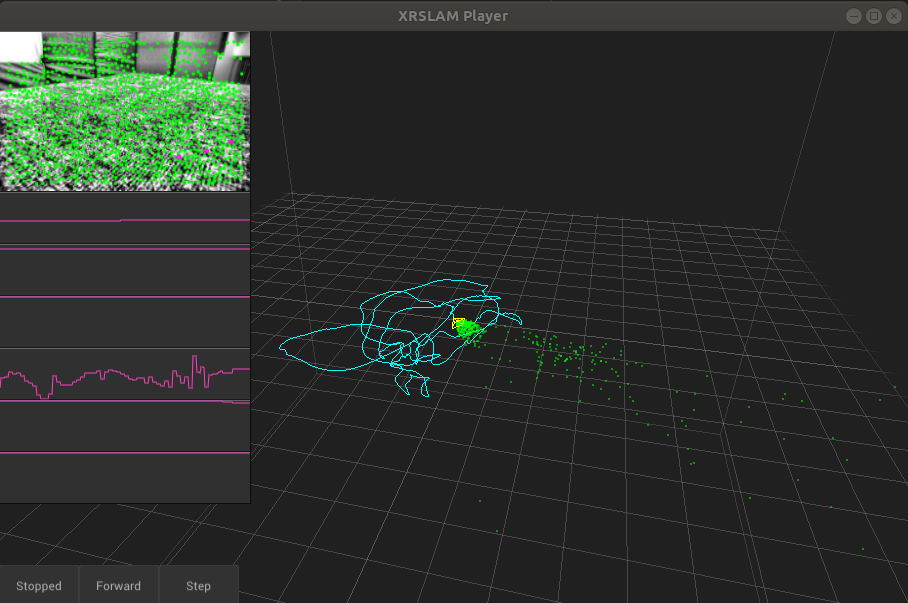
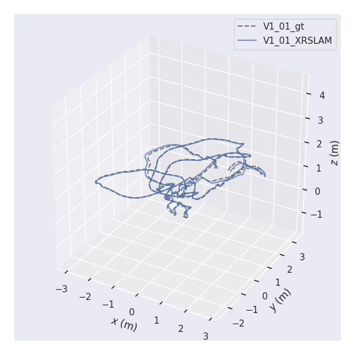

# Benchmark

We run our algorithm on EuRoC dataset on Ubuntu18.04 and macOS 10.14. And make comparisons with the state-of-the-art VIO systems. We analyze the accuracy of the algorithm by comparing the root mean squared error (RMSE) of the absolute trajectory error (ATE). ATE is given by the simple difference between the estimated trajectory and ground truth after it has been aligned so that it has a minimal error, and RMSE is the standard deviation of the residuals (prediction errors). The lower the RMSE, the better a given trajectory is able to fit its ground truth. We use "evo" tool to evaluate and compare the trajectory output of odometry and SLAM algorithms, and for more information please refer to [euroc evaluation](./tutorials/euroc_evaluation.md). We have achieved obvious better results on EuRoc and ADVIO datasets, which proves the effectiveness of our system.

**SF-VIO** completely disables the dynamic object removal strategy in XRSLAM, which can be enabled in the configuration *parsac_flag*. When the flag activated, it is referred to as **RD-VIO**. As shown in the following tables, the best results for visual-inertial algorithms are bolded. Comparing with other systems, SF-VIO showed significant improvements on many sequences on EuRoC dataset. Thanks to the additional stabilization effect, the significant drifts are canceled when using  the subframe strategy in our system.

As a challenging dataset in real-world settings, ADVIO offers 23 diverse scenarios, encompassing indoor and outdoor environments, varying lighting conditions, and dynamic elements such as pedestrians and vehicles. Compared to SF-VIO without dynamic object removal strategies, RD-VIO showed significantly better RMSEs on ADVIO dataset.

**Tracking Accuracy (RMSE in meters) on the EuRoC Dataset.**
| Algorithm   | MH-01 | MH-02 | MH-03 | MH-04 | MH-05 | V1-01 | V1-02 | V1-03 | V2-01 | V2-02 | V2-03 | AVG   |
|-------------|-------|-------|-------|-------|-------|-------|-------|-------|-------|-------|-------|-------|
| **SF-VIO**  | 0.109 | 0.147 | **0.131** | 0.189 | 0.240 | **0.056** | 0.101 | 0.134 | 0.066 | 0.089 | **0.122** | **0.125** |
| **RD-VIO**  | **0.109** | 0.115 | 0.141 | 0.247 | 0.267 | 0.060 | 0.091 | 0.168 | 0.058 | 0.100 | 0.147 | 0.136 |
| **LARVIO**  | 0.132 | 0.137 | 0.168 | 0.237 | 0.314 | 0.083 | **0.064** | 0.086 | 0.148 | 0.077 | 0.168 | 0.147 |
| **Open-VINS**| 0.111| 0.287 | 0.181 | **0.182** | 0.365 | 0.059 | 0.084 | **0.075** | 0.086 | **0.074** | 0.145 | 0.150 |
| **VI-DSO**  | 0.125 | **0.072** | 0.285 | 0.343 | **0.202** | 0.197 | 0.135 | 4.073 | 0.242 | 0.202 | 0.212 | 0.553 |
| **OKVIS***  | 0.342 | 0.361 | 0.319 | 0.318 | 0.448 | 0.139 | 0.232 | 0.262 | 0.163 | 0.211 | 0.291 | 0.281 |
| **MSCKF**   | 0.734 | 0.909 | 0.376 | 1.676 | 0.995 | 0.520 | 0.567 |   -   | 0.236 |   -   |   -   | 0.752 |
| **PVIO**    | 0.129 | 0.210 | 0.162 | 0.286 | 0.341 | 0.079 | 0.093 | 0.155 | **0.054** | 0.202 | 0.290 | 0.182 |
| **DynaVINS**| 0.308 | 0.152 | 1.789 | 2.264 |   -   |   -   | 0.365 |   -   |   -   |   -   |   -   | 0.976 |
| **VINS-Fusion(VIO)** | 0.149 | 0.110 | 0.168 | 0.221 | 0.310 | 0.071 | 0.282 | 0.170 | 0.166 | 0.386 | 0.190 | 0.202 |
| **ORB-SLAM3(VIO)**| 0.543 | 0.700 | 1.874 | 0.999 | 0.964 | 0.709 | 0.545 | 2.649 | 0.514 | 0.451 | 1.655 | 1.055 |
 

**Accuracy on the ADVIO Dataset**
| Sequence | **SF-VIO** | **RD-VIO** | **VINS-Fusion(VIO)** | **LARVIO** |
| :------: | :--------: | :--------: | :------------------: | :--------: |
|    01    |   2.177    |   **1.788**    |        2.339        |   5.049    |
|    02    | **1.679**  |   1.695    |        1.914        |   4.242    |
|    03    |   2.913    |   2.690    |      **2.290**      |   4.295    |
|    04    |     -      |   **2.860**    |        3.350        |     -      |
|    05    |   1.385    |   1.263    |      **0.938**      |   2.034    |
|    06    |   2.837    |   **2.497**    |       11.005        |   8.201    |
|    07    |   0.559    |   **0.548**    |        0.912        |   2.369    |
|    08    |   2.075    |   2.151    |      **1.136**      |   2.078    |
|    09    | **0.332**  |   2.281    |        1.063        |   3.168    |
|    10    |   1.997    |   2.128    |      **1.847**      |   4.742    |
|    11    |   4.103    | **3.986**  |       18.760        |   5.298    |
|    12    |   2.084    |   1.951    |          -           | **1.191**  |
|    13    |   3.227    |   2.899    |          -           | **1.324**  |
|    14    | **1.524**  |   1.532    |          -           |     -      |
|    15    | **0.779**  |   0.780    |        0.944        |   0.851    |
|    16    | **0.986**  |   0.991    |        1.289        |   2.346    |
|    17    |   1.657    | **1.235**  |        1.569        |   1.734    |
|    18    |   1.164    | **1.057**  |        3.436        |   1.171    |
|    19    |   3.154    |   2.740    |      **2.010**      |   3.256    |
|    20    |   7.013    | **6.960**  |       10.433        |     -      |
|    21    |   8.534    | **8.432**  |       11.004        |   8.962    |
|    22    |   4.548    | **4.498**  |          -           |   4.686    |
|    23    |   6.486    |   5.085    |      **4.668**      |   9.389    |
|   AVG    |   2.873    | **2.671**  |        3.272        |   3.699    |
 

