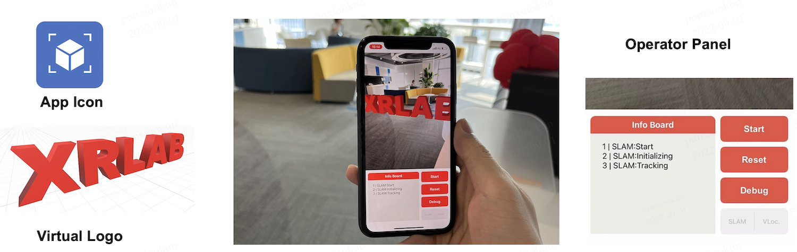

# AR Application on iPhone

There are some guides to use the AR application

- `Info Board`: Print various information about the status of SLAM.
- `Start`: Start the SLAM system.
- `Reset`: Reset the SLAM system if it is running.
- `Debug`: Query current frame's localization. As its name indicates, it can be used to debug and develop new features as you like.
- `SLAM/VLoc.`: switch to which mode: SLAM or VLoc. SLAM is the default mode. VLoc. mode need the localization service. Please refer to [XRARDemo](https://doc.openxrlab.org.cn/OpenXRLab_docment) for more detail.

After opening the App, we need to click the `Start` button to launch the SLAM. A toast labeling `Initializing the SLAM` will appear. In this step, you need to move in a curved trajectory to make the SLAM initialize well. When the SLAM system has successfully initialized, the toast will fade out. When there is a plane in the scene of view, we can add virtual objects such as cube to the scene by **tapping the screen**.

It should be noted that the position where virtual object placed is determined by the center of the 3D point cloud in the middle area of the current frame, so the virtual object may not be well placed on the plane. As for virtual objects, you can easily customize your own AR demo by adding custom 3D models and updating the corresponding codes.

Finally, please be careful of the matters related to the [supported devices](../supported_devices.md)
