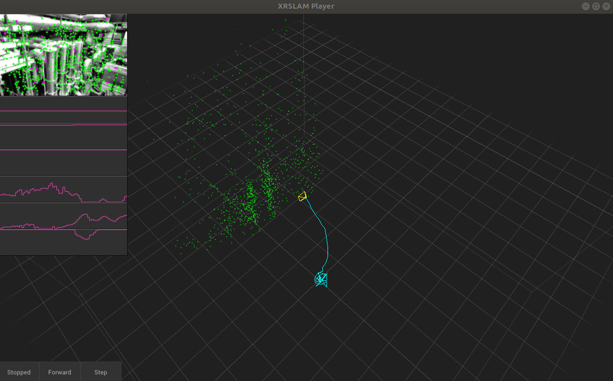

# Run EuRoC

<div align='center'></div>

Download EuRoC dataset to YOUR_DATASET_FOLDER. Take [MH_01_easy ](http://robotics.ethz.ch/~asl-datasets/ijrr_euroc_mav_dataset/machine_hall/MH_01_easy/MH_01_easy.zip)for example.

Start the XRSLAM pc player using the following command line

```bash
./build/xrslam-pc/player/xrslam-pc-player -sc configs/euroc_slam.yaml -dc configs/euroc_sensor.yaml --tum trajectory.tum euroc:///data/EuRoC/MH_01_easy/mav0
```

+ Click the first button "Stopped" of the player to automatically execute the program on the whole sequence. (recommend)
+ Long press the second button "Forward" to run the program continued until the mouse button is released.
+ Click the last button "Step" to run the program by inputting a single image of the sequence.
+ Click the left mouse button to rotate the viewing angle, and slide the mouse wheel to scale the viewing size.
+ The six red curves on the left represent real-time estimated bg_x, bg_y, bg_z, ba_x, ba_y, ba_z.
+ The trajectory will be written in `$PROJECT/trajectory.tum`.

# Evaluation

[evo](https://github.com/MichaelGrupp/evo) is a python package for the evaluation of odometry and SLAM. You can install it quickly through the following command:

```bash
pip install evo
```

evo only supports drawing in "tum" format, and it provides a tool for converting "euroc" format to "tum" format.

```bash
cd data/EuRoC/MH_01_easy/mav0/state_groundtruth_estimate0
evo_traj euroc data.csv --save_as_tum
```

After converting the ground truth trajectory to the "tum" format,  you can evaluate the accuracy by

```bash
evo_ape tum data.tum $PROJECT/trajectory.tum -a
```

You will get the RMSE of XRSLAM on MH_01 sequence, in which APE is 0.109.
